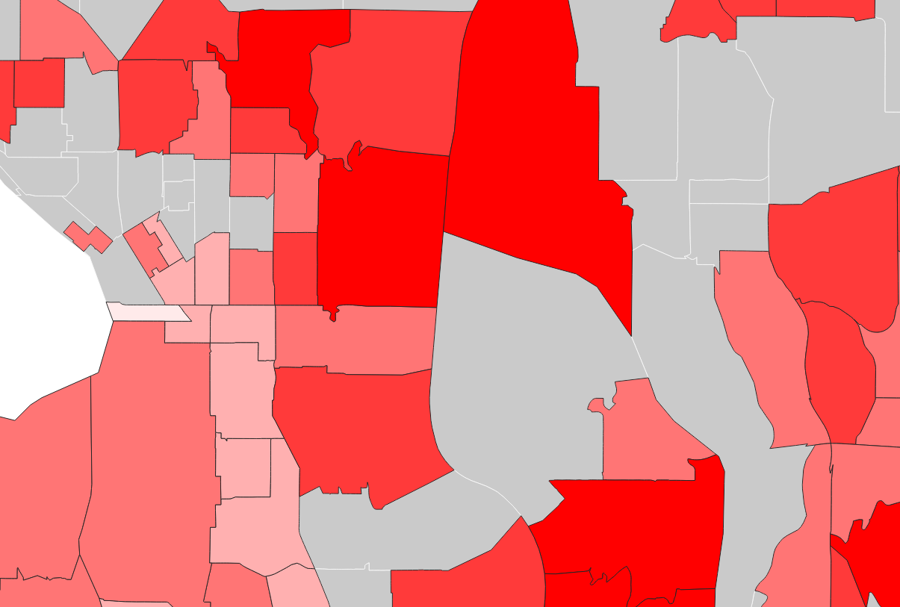

# GEOG_458_Map_Tiles
A Tile Creation Web Mapping Exercise

## Web Map Map Info
* [Link to Web Map](https://littlewolverine.github.io/GEOG_458_Map_Tiles/)
* Geographic Area: Seattle and suburbs east of Seattle
* Tileset Zoom Levels: 3-14

## Tile Sets:

### Slightly Altered Monochrome Basemap:

This is a bare-bones base map modeled after the dark monochrome basemap in Mapbox.

### 2020 Household Median Income Layer

This is a map layer that shows median income by census tract from the US 2020 census. Gray tracts have no data. Cleaned census data that was used can be found [here](https://github.com/littlewolverine/GEOG_458_Map_Tiles/blob/main/assets/data/median_income_20.csv). This layer was created in QGIS by joining that dataset to a shapefile of US census tracts.

### Census tracts on top of basemap

This layer is pretty self-explanatory. It was created by overlaying the data from layer 2 over layer 1. For tracts where I have data, I made the solid color transparent. Where I did not have a data, I just have outlines of the tracts.

### Policing themed basemap

Mine and my group's final project is on policing in the united states, so I wanted to make a basemap with colors chosen from an image of police. I used the image below as a reference image in mapbox studio, and chose the "dark" option to create the basemap.

